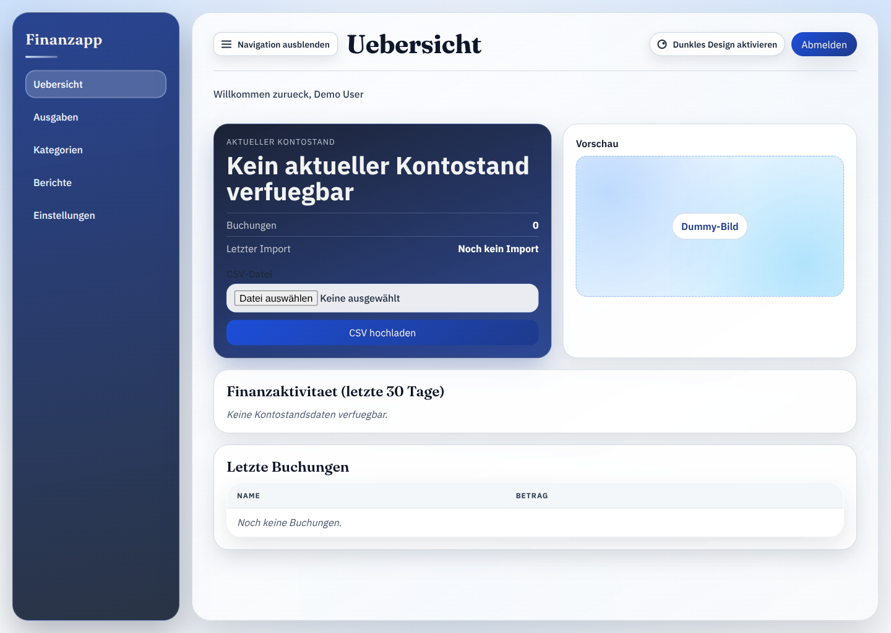
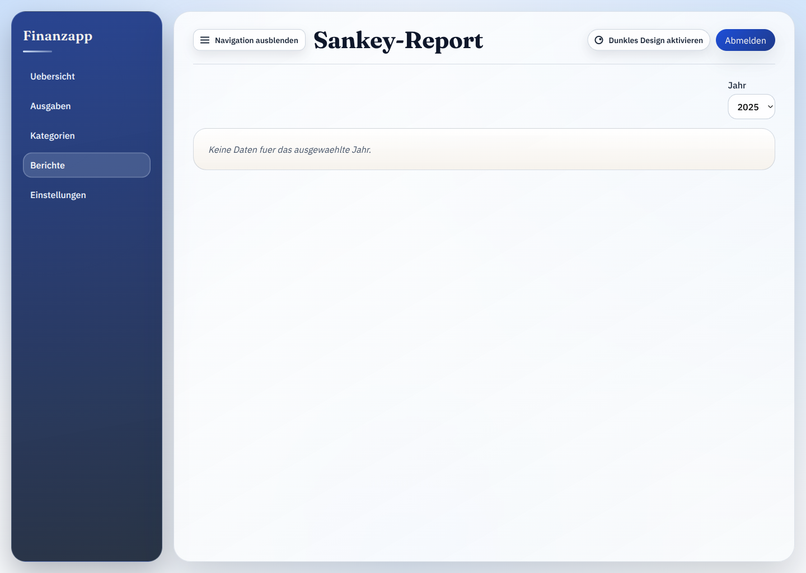

# Finanztool

Finanztool ist eine lokale Web-Anwendung, mit der du deine Bankdaten uebersichtlich analysieren und im Alltag schneller auswerten kannst als in vielen Bank-Apps.

Motivation: Die Standardansichten in Bank-Apps reichen oft nicht fuer klare Entscheidungen. Dieses Projekt schafft eine fokussierte Sicht auf Transaktionen, Kategorien, Regeln und Verlaeufe.

## Einblicke in die App





## Wofuer du es nutzen kannst

- Eigene Konto- und Buchungsdaten strukturiert betrachten
- Transaktionen filtern, kategorisieren und bereinigen
- Wiederkehrende Kategorisierung ueber Regeln automatisieren
- Kontoverlauf und Geldfluss visuell auswerten

## Kernfeatures

- Authentifizierung mit Registrierung, Login und geschuetzten Bereichen
- Dashboard mit Saldoverlauf und aktuellen Transaktionen
- Transaktionsliste mit Filtern und Aktionen (z. B. Soft-Delete, Kategorie setzen)
- CSV-Import fuer Bankdaten
- Kategorien verwalten (inkl. Export/Import)
- Regeln verwalten und ausfuehren (inkl. Export/Import)
- Sankey-Report fuer Geldflussanalyse
- Einstellungen fuer Profil, Sprache und Datenloeschung

## Technologie-Stack

- Java 21
- Spring Boot 3
- Thymeleaf
- SQLite
- Flyway Migrationen
- Maven

## Release-Prozess

- Dependabot prueft taeglich Maven- und GitHub-Actions-Abhaengigkeiten und erstellt bei Updates PRs.
- Dependabot-PRs werden nach erfolgreichem `Build`-Workflow automatisch gemerged.
- Bei Dependabot-Updates laeuft nach dem Merge auf `main` der komplette `Build`-Workflow inkl. Tests und Sonar-Analyse.
- Ist dieser Lauf erfolgreich, erhoeht der Job `Dependabot Version Bump` im `Build`-Workflow automatisch die Patch-Version in `pom.xml`, baut das neue Jar und pusht den Versions-Commit.
- Der naechste erfolgreiche Build erstellt den GitHub Release mit Tag `release-<version>-<sha7>`.
- Zusaetzlich wird eine SBOM im CycloneDX-JSON-Format mit Syft erzeugt und als Release-Asset angehaengt.

## Anwendung lokal starten

### Voraussetzungen

- Java 21 installiert
- Maven installiert

### Schnellstart (Entwicklung)

```bash
mvn spring-boot:run
```

Danach ist die Anwendung unter `http://localhost:8080` erreichbar.

### Optional: Build und Start als Jar

```bash
mvn -DskipTests package
java -jar target/finanzapp-mvp-0.0.1-SNAPSHOT.jar
```

## Demo-Account

- E-Mail: `user@example.com`
- Passwort: `password123`

Hinweis: Falls dieser Account lokal noch nicht existiert, kannst du ihn ueber `/register` mit denselben Daten anlegen.

## Verifikation (Smoke)

```bash
mvn -DskipTests compile
mvn -Dtest=CsvParserTest,CsvImportServiceTest,TransactionViewServiceTest test
```
